# Erik game (Color game)
 
A website for people to play a version of the famous Simon Game. But this game is called Erik game. Instead of trying to match the computer color sequence, the user must hit a different color sequence. To win the game the user has to complete 10 levels, for each level the computer will increase one more color to the sequence. 
 
To play the game you can cklick this [link](https://erikandersson96.github.io/portfolio-project-two/). (Opens in a new tab).
 

 
 
 
---
## Portfolio Project Two 
 
---
### Intention
 
This website is a `fictional website` for the purpose of my Second Portfolio Project for Code Institute’s Full Stack Software Development Course. I created this website with the knowledge I gained from the `HTML`, `CSS` and `JavaScript` modules. 

The main goal with this project was to test my new knowledge in JavaScript. I decided to create my own version of the famous Simon Game, but with a twist. I reversed the logic of the game so the player needs to play his/her own sequence in order to win over the computer.
 
* Features I aimed to achieve with this project:
 
* To make the game `easy` to understand.
* Create a game with an old style interface `(Trying to take the user back to the 90's)`.
* Use a `Wrapper` for all text and the game itself to create a `“stand out”` feeling and catch the attention of the user.
* Create a game that everyone at any age can play!
 
---
## Table of Contents 
 
* [UX](#ux-user-experience)
 * [Visitor Goals](#visitor-goals)
 * [User Stories](#user-stories)
 
* [Wireframes](#wireframes)
 * [First Idea](#first-idea)
 * [Comparison](#comparison)
 
* [Website Design](#website-design)
 * [Color Scheme](#color-scheme)
 * [Fonts](#fonts)
 
* [Existing Features](#existing-features)
 * [Navigation Bar](#navigation-bar)
 * [Landing Page](#landing-page)
 * [Footer](#footer)
 * [About us](#about-us)
 * [Get in touch](#get-in-touch)
 
* [Future Features](#future-features)
 * [Learning Points](#learning-points)
 
* [Testing](#testing)
 * [Devices](#devices)
 * [Validator Testing](#validator-testing)
 * [Lighthouse Dev Tool](#lighthouse-dev-tool)
 * [Wave Page](#wave-page)
 * [Fixed Bugs](#fixed-bugs)
 * [Unfixed Bugs](#unfixed-bugs)
 
 
* [Deployment](#deployment)
 * [Creating My Website](#creating-my-website)
 * [GitHub Pages](#github-pages)
 
* [Credits](#credits) 
 * [Inspiration for this project](#inspiration-for-this-project)
 * [Content](#content)
 * [Media](#media)
 
* [Support](#support)
 
 
---
## UX (User Experience)
 
### Visitor Goals
 
* To quickly understand how the game works.
 
* To be accessible on all devices.
 
 
### User Stories
 
* A user's perspective: I want to easily understand the purpose of the website.
* A user's perspective: I want to easily understand how to play the game. 
* A user's perspective: I want the website to offer a clean interface.
 
 
---
## Wireframes
 
* First `11 images` is from the first visual idea for my project. As you will recognise from comparing my wireframes to the final product, you will see that my final product doesn't look like my wireframes at all. That has to do with a lot of different reasons that I will explain underneath all images. The wireframes was created using [Balsamiq - Balsamiq Wireframes](https://balsamiq.com/) (link). 
* Second row containing `1 image` is from the final product of the website. To give you a comparison.

### First Idea
 
**First website idea (wireframes):**

**Mobile:**

 
 

**Tablet:**

 
 
 

**Desktop:**

 
 
 
 
 
 

### Comparison
 
**Final product:** **(desktop)**
 
Landing page. 

Easy Interface. 

Medium Interface. 

Hard Interface. 

 

Footer (social media links). 

 

#### Changes:

Using DOM instead of multiply HTML files: 
* As you can see, I choose to only display the game on the "Landing page". Beacuse my game only exist on one page, at first I didn't really understood the princip of DOM so I tought that I would create one HTML page for each "function" of the game. Like creating one Landing page that displayed some information about the game and a button that would take the user to the next page(HTML file) which would have been game-level(User name) with the choice of three difficulty levels and a Play button. After that a page with the correlated game interface (Easy, Medium or Hard) and so on as you can see in my wireframes. But I quickly realized that if I instead used the DOM I could keep everything within one HTML file. I will display with images my first repository and each html file that i created before I choose to create this repository and work with DOM instead. Worth mentioning is that this first repository never had finsihed CSS so the styling is not what is importent, I just want to give you as a reader a better understanding of how complex things could have been for me if I didn't go with using the DOM. 
 
Using Game Interface of circles instead of pieces like the wireframes: 
* I also choose to go with `another` style of my buttons for the game. Instead of using pieces like in the wireframe and in the original Simon Game, I chose to go with four circles. This was beacuse I felt that I am not to comfortable with my CSS skills to experiment with styles like that, maybe in the future.   
 
* In the footer I chose to only use social media links like `My own Github, Instagram, Youtube`. I felt that it looked cleaner to only have Social media platforms here instead of credits.
 
* Lastly, I decided to go with a simple design that had a look of an old game, so therfore I didn't experiment to much with the design of my final product. I wanted the game to be straight forward so the user could understand the game fast and start playing. 

#### Images of first repository **(without using DOM):** 

**HTML files.**

Index file. 

 

Select difficulty file. 

 

Easy interface file. 

Medium interface file. 

 

Hard interface file. 

 

**Interface - users perspective.**

Landing page. 

 

Choose difficulty. 

 

Easy Interface. 

 

Medium Interface. 

 

Hard Interface. 

 

## Flow diagram 

* Before I started my project my mentor [Ben](https://github.com/BAK2K3) wanted me to do a `Flow diagram` there I tried to display how my JavaScript logic would work. 
So I followed his advice and created a `Flow diagram` with [Lucid chart](https://www.lucidchart.com/pages/). When I created my `Flow diagram` I had not started with my JavaScript for my 
project yet, so there will be some differences between the `Flow diagram` and my final JavaCript code. But my `Flow diagram` would at least give you as a reader an idea of 
how the JavaScript logic works. I will both display my `Flow diagram` underneath but also give you some pointers to what is different with my JavaScript code: 

**Flow diagram:** 

 

**Differences:** 

* In the flow diagram I first thought I would create a direct replica of Simon Game so my logic in the `Flow diagram` tells you that `"User try to match sequence"` as in the original 
Simon Game but in my final product `Erik game` the user is not supposed to match the color sequence of the computer in order to win. 

* The User interface (UI) says that `Easy` whould have 4 different colors, `Medium` whould have 6 different colors and `Hard` would have 8 different colors. But in `Erik game` the 
User interface looks a little bit different with `Easy` that has 5 different colors, `Medium` has 4 different colors and `Hard` has 3 different colors. 

* The condition that checks if the user's input is either `true` or `false` would in this case be `false` it would trigger the alert message with `"Game over play again!"` but I should 
also have added so the condition checks if the user has completed all levels (10/10) and then trigger an alert message with `You won!`. In `Erik game` the logic is created this way that the 
condition both checks each round if it is `true or false` for the color sequence but also if the user has completed all levels or not. 

---
## Website Design
 
Logo design - Because this website was created with the intention to keep it clean and simple. I decided to go with only `“Erik game”`. Beacuse I thought it gave the game a simple and clean look.
 
Background Image - I downloaded this image from `pixabay.com` which is a website with free images. And I used a `black background color` to it in case the image wouldn't load.

`Wrapper` - I chose a `"Wrapper"` to contain the game and all other text on the page to let the Game stand out from the background image and make it look better.

Website Colors - I went for a lighter green with almost a little neon effect to my Wrapper, difficulty selector and footer (social media links), beacuse I thought it was a nice contrast to my background-image that has green "neon" stripes in it. For my difficulty selector I used a dark green for when the User has selected a difficulty. For my description box (description of the game) and Start game button I chose a little darker green to let it `Stand out` from the Wrapper. For my game controlls (circles) I chose Green, Blue, Yellow and Red beacuse I think it looks the best. 
  

### Color Scheme
 
* I went for eight different colors for the website. `Light neon green` for the `Wrapper, difficulty selector and social media links`, little darker green for the `description box and the "Start game" button`, black for all `text`, dark green for the selected `difficulty` and my circles has `green, blue, yellow, red`.
 
**#11D6A1 - Light neon green (HEX-color)**
 

 
**#0fbd8e - Little darker green (HEX-color)**
 

 
**Black - color (Default color)**
 
 

**#0ca17a - Dark green (HEX-color)** 

 

**Green - color (Default color)**

 

**Blue - color (Default color)**

 

**Yellow - color (Default color)**

 

**Red - color (Default color)**
 
 

**Orange - color (Default color)** 

### Fonts
 
* I used two different fonts for the website. `"nunito"` for my `logo` and `“Roboto Mono”` for all other text with `sans-serif` as a backup if `“nunito” or "Roboto Mono"` wouldn’t work.  The `"nunito"` and `“Roboto Mono”` fonts were taken from `Pairfonts`. I chose this combination beacuse for me it looked the most like an old game so I think they complements each other well for this game. 
 
**nunito, for my logo:**
 

 
**Roboto Mono, all other text:**
 

 
---
## Existing Features
 

### Game Interface  
 
* Beacuse this is a very simplistic game I only have one page for my website. The `"Landing page"` exist of a background image `"A space corridor"` and a `"Wrapper"` for 
all the content of my game. The description `"box"` is contained with a black thin border that has the same rounded edges as the `"Wrapper"`, the difficulty selector is styled 
with black borders as well to capsule each diffuculty `Easy | Medium | Hard`. The `Start game` button is the only `"box"` in the Interface that I have kept square in it's shape, to 
keep it original. The game controlls `"circles"` has all the same round shape to them. 
  
* The `"Wrapper"` creates an eye-catching contrast to grab the user's attention. 

* The `description box` and the `difficulty selector` has a border around it to make it stand out and be easy to read. 
 
 ÄNDRA BILD HÄR TILL HELA SKÄRMEN MED DEN FIXAD FOOTERN!

 
### Footer
 
* The footer includes all the social media links to the relevant social media platform. The links will open in a new tab to not confuse the user. Or open each social media platform application on the device if the user interacts on a mobile device or tablet. The icons for the social media links have been used from `Font Awesome` and they all have the same color 
as the `Wrapper`. 
 

 
### Easy difficulty 

### Medium difficulty 

### Hard difficulty 

---
## Future Features
 
### Learning Points
 
* I'd like to include feedback to the user so they are aware that the information was submitted from the `Contact Form.` I didn't have the knowledge to include a `“Thank you for Submitting”` pop-up or redirect to a new page. But I will include this as soon as I have the knowledge required to do so in the next projects.
 
* I made some mistakes when positioning each element: the text on the first page, the About us page, the Price information, and the `Contact form` on the third page. I used `"absolute"` instead of `“relative”` position which forced me to create a total of `13 Media Screen size breakpoints.` This is a mistake that I will take with me into the next project and improve upon to increase the amount of breakpoints. I will also start with creating the website for my next project on a mobile device first because it's much easier to expand the screen size than increase the screen size as I did with this project, which resulted in a lot of time wasted.
 
* I also learned when git commit a message in `Gitpod` I should have only included what was relevant to that commit. I may have committed a message which included more changes than I added in that exact commit message, not only once but a couple of times. This is something that I will improve in my next project to be more consistent and correct with my commit messages.
 
* The way I structured my `Media Screen size breakpoints` will improve for future projects. When I ran the `W3C CSS Validator` I got a ton of errors because I had included attributes in every `Media queries` even if they were not changed between screen sizes which resulted in `287 parse errors`, but they are all fixed now.
 
ÄNDRA HÄR MED!!
---
## Testing
 
* The interface of the game has been tested across all screen sizes for a responsive experience. The size of the `logo, description box, choose difficulty and the circles` will all 
change size at a break-point of 350px. I tested this in the `Chrome dev tool, so I have not tested it on actual devices`.
 
* I used validators to ensure that my code was correct and up to standard. I did this with the use of `W3C validator` for HTML, `Jigsaw Validator` for CSS and 
`JS Hint` for JavaScript.
 
* I made sure that the website looks good down to a screen size of 278px wide.
 
* All links to external websites open in a new browser.
 
* My difficulty selctor marks the selceted difficulty Easy | Medium | Hard, with a darker green to let the user know what is been selected. 

 
### Devices
Something that's worth mentioning is that I've tested the majority of these devices within `Chrome dev tool`, I have not had physical access to test these devices.
I have tested the responsiveness and aesthetics on the following devices and browsers:

* **Apple**
 * iPhone 5/SE
 * iPhone 6/7/8
 * iPhone 6/7/8 Plus
 * iPhone X/11
 * iPad
 * iPad Pro

* **Android**
 * Samsung Galaxy S8
 * Microsoft Surface Duo
 
* **Google Devices**
 * Google Nest Hub
 * Google Nest Hub Max
 
* **Motorola**
 * Moto G4
 
* **Desktops/laptops**
 * MacBook Pro 13"
 * Lenovo 24" monitor
 
* **Browsers**
 * Chrome 
 * Safari 
 
 
---
### Validator Testing
 
* **HTML-Validator**
 
When testing the website link at [W3C Validator](https://validator.w3.org/) I got 2 errors, I will show them here: 

**Error 1:**
 
I've got an error for using a `div` element as a child of my `label` element. 
 

**Solution:**
 
I deleted the `div` beacuse it was just unnecessary. Beginner misstake. 

**Error 2:**
 
Empty heading, beacuse I let my `h3` heading be empty between it's opening and closing tags.
 

**Solution 2:**
 
I deleted my `h3` heading and added a `div` instead with the same class as my `h3` had. I actualy got more satisfied with this solution not only beacuse of the validation 
but beacuse then the level counter isn't displayed before the game starts, just the way I wanted it to be to start with but forgot to change. 

**After I applied the HTML solutions:**
 
Here you can take a look at my `Approved` HTML validation for my [Erik game](https://validator.w3.org/nu/?doc=https%3A%2F%2Ferikandersson96.github.io%2Fportfolio-project-two%2F). 

* **CSS-Validator** 
 
When testing the website link at [Jigsaw Validator](https://jigsaw.w3.org/css-validator/validator.html.en) I got these results:

**Congratulations! No error found.**

Here is a link to my Approved CSS jigsaw [Validator](https://jigsaw.w3.org/css-validator/validator?uri=https%3A%2F%2Ferikandersson96.github.io%2Fportfolio-project-two%2F&profile=css3svg&usermedium=all&warning=1&vextwarning=&lang=en).
 

---
### Lighthouse Dev Tool
I used `Chrome lighthouse dev tool` to test the website `performance`. I’ve got an average result of `97,25%` for desktop and `99,25%` for mobile devices.

**Desktop**
 

 
**Mobile**
 

 
---
### Wave Page
 
* Erik game has been tested through [wave.webaim.org](https://wave.webaim.org/) for accessibility.
 
You can look at the approved result [here](https://wave.webaim.org/report#/https://erikandersson96.github.io/portfolio-project-two/).

* When I tested my webpage first I got 2 alerts. 

**First alert.** 

I got this beacuse I hadn't added a `fieldset` or `legend` for my `Radio Buttons` in my index file. When I googled this I found that I should use it in consideration for `screen readers`. 
So I added it but then I didn't like the look of a border and a legend around my radio buttons so I applied some CSS to hide them. 

**Second alert.**

I got this beacuse I had used a `h3` element for my `"Choose difficulty level"` above my `Radio Buttons`, and after some googling I understood that I should use an 
`h2` instead beacuse my logo is `h1` and this was the second heading level for my index file structure. So I changed to an `h2` and styled it with css to have 
the correct size and font. 

---
## Fixed Bugs
 
* When I first completed my JavaScript code and was satisfied with my styling I tested Erik game a couple of times both on desktop but also on a mobile device. 
After a while I got to the conclusion that when playing in `Hard` difficulty (2 colors) It could quickly become impossible to win over the computer, beacuse if the computer 
had flashed first `yellow` and secondly `green` the user wouldn't have any option to start. This was beacuse the user can't start with pressing the same color as the computer started or finsih with otherwise the user would lose. So to prevent this I had to come up with a solution. So I added one more color of `orange` to `Easy` in the middle that will be hidden in 
`Medium and Hard` difficulty. So `Medium` got 4 `colors` instead and `Hard` got 3 `colors`. The solution I applied is this: 

**Bugg before:** 

 

**Solution:** 

* Footer. LÄGG TILL HÄR!

---
## Unfixed Bugs
 

---
## Deployment
 
### Creating My Website
 
When I created this website I used the `Code Institute Gitpod Full Template`.
 
I frequently used `commit` throughout the whole project, this is the commands used in the terminal: 
 
`git add .` (This command is used for adding files to the staging area before committing).
 
`git commit -m “commit message here..”` (This is used to label the commit changes made to the local repository).
 
`git push` (This command is used to push all changes to the Github repository).
 
This is all done to prevent any `data` loss in case Gitpod crashes.
 

---
## GitHub Pages
 
* The site was deployed to GitHub pages. The steps to deploy are as follows:
 
1. Log in to Github and locate the Github `Repository`.
1. In the Github repository, navigate to the `settings` tab.
1. In the menu to the left, you will find `Pages` almost at the bottom of the list.
1. Under `“Source”`, click the dropdown menu called `“None”` and select `“Main”`.
1. Click `save` and the page will automatically refresh with the website link displayed.
1. The published `link` will show up above. Alternatively, click this [link](https://erikandersson96.github.io/portfolio-project-two/).
(Link opens in a new tab). 
 

---
## Credits 

### Inspiration for this project 

The inspiration for my Simon Game JavaScript code was taken from this [tutorial](https://freshman.tech/simon-game/), beacuse my knowledge for JavaScript is very low and for me to create 
a game like Simon Game as my first ever project in JavaScript out of only what I knew when starting out with my Portfolio Project Two was to big of a task. So therefore I chose 
together with my mentor `Benjamin Kavanagh` to follow that guide as support but to use my own words and create my own version of it, which I ended up with Erik game. Instead of 
doing a `"regular"` Simon Game as the original I created a reverse version with the goal to not press the same color sequence as the computer in order for the user to win.
The code that I have that is still the same as in the tutorial is `resetGame function()`, `humanTurn function()`, `activateTile function()`, `playRound function()`, 
`nextStep function()`, `nextRound function()`, `startGame function()`, `startBtn event listener`. 
Here is also a live version of Freshmans Simon Game [link](https://freshman-simon.surge.sh/). (Links opens in a new tab). 
I will compare the guide's code to my code down below with both text and images: 

#### Tutorial - Freshman Simon Game

**Freshman JavaScript Code:** 

ResetGame function(). 

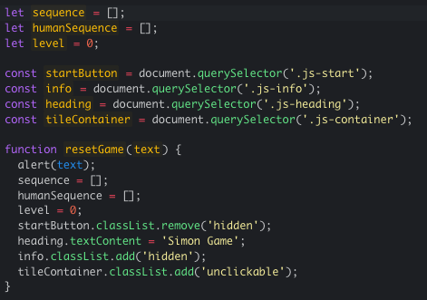 

HumanTurn function(), ActivateTile function(), PlayRound function(). 

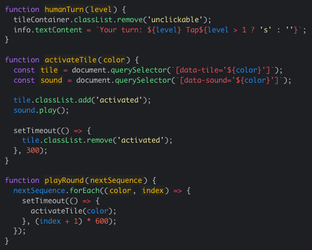 

NextStep function(), NextRound function().

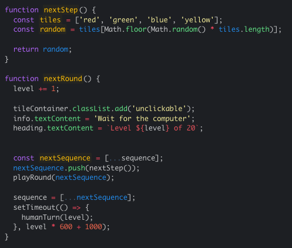 

StartGame function(), StartButton event listener. 

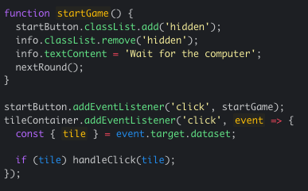

**Freshman Final product:**

Start page, Freshman Simon Game. 

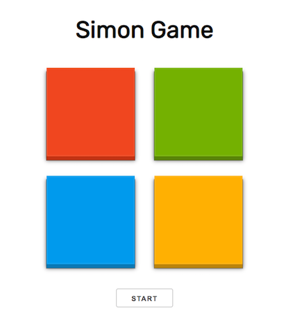 

Game interface, Freshman Simon Game. 

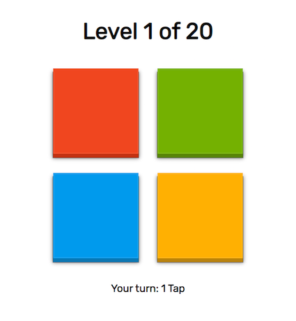

Reset game, Freshman Simon Game. 

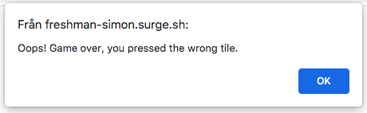 

You won the game, Freshman Simon Game. 

#### My project - Erik game

**JavaScript Code:** 

Reset game function(). 

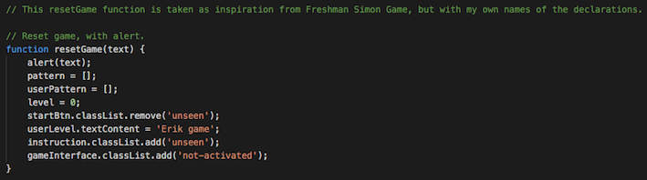

Human turn function(). Name in my code: userTurn., 
Activate tile function(). Name in my code: activateCircle., 
Play round function(). Name in my code: playPattern. 

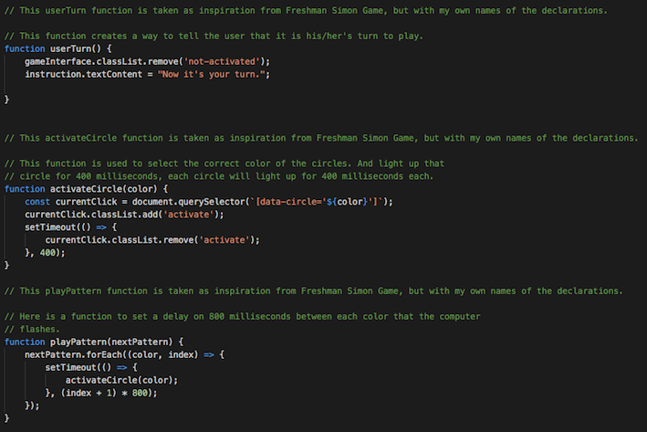

NextStep function(). Name in my code: nextPhase.

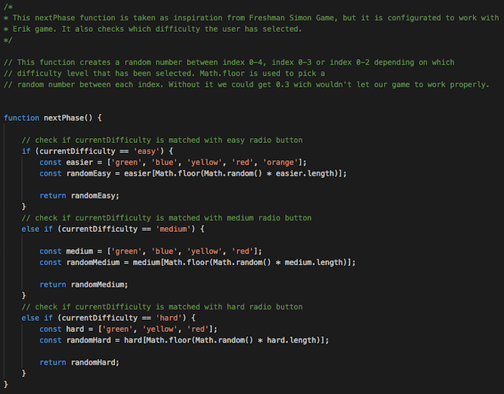 

NextRound function(). Name in my code: nextTurn. 

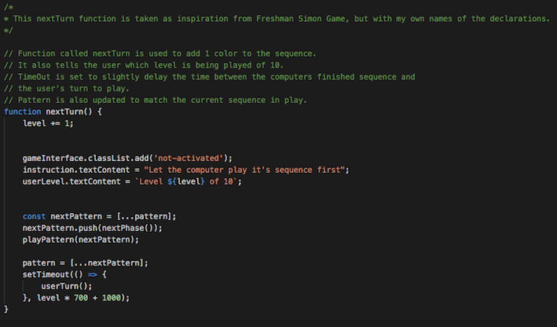

StartGame function(). 

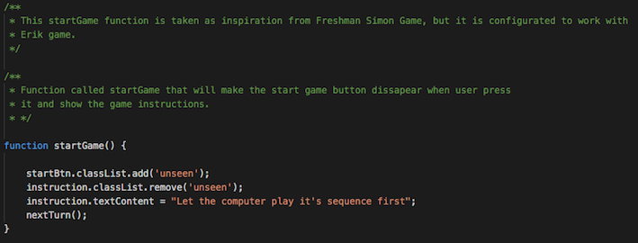 

StartButton event listener. Name in my code: startBtn.

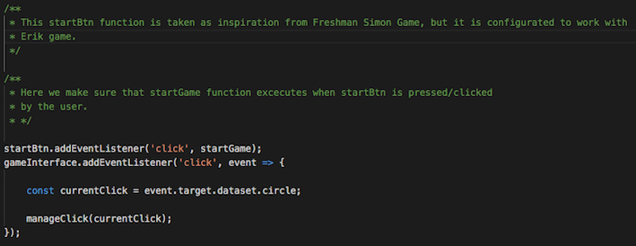 

**Final product:**

Start page, Erik game. 

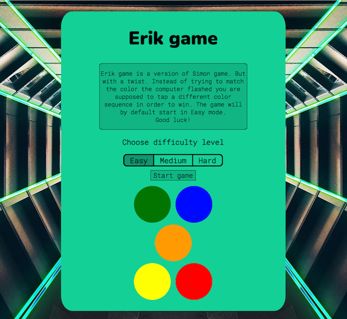

Game interface, Erik game. 

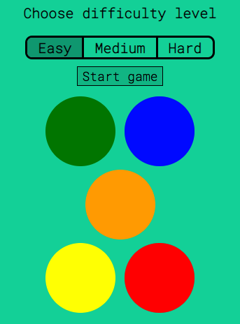

Reset game, Erik game. 
The alert message for reset game works the same as in Freshman Simon Game. 

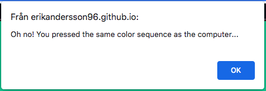 

You won the game! Erik game.  
The alert message for you won the game works the same as in Freshman Simon Game.

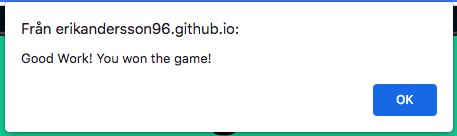 

#### Styling for radio buttons

* The inspiration for my radio buttons, `Easy | Medium | Hard` has been taken from [this](https://codepen.io/skeddles/pen/PbROLK) codepen link
that I found from this article [link](https://freefrontend.com/css-radio-buttons/) (both links opens in a new tab). 

**Image inspiration:** 

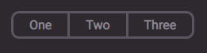

**My radio buttons:** 

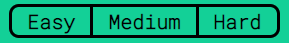

### Content

**Styling**
* The `Wrapper` inspiration was taken from `Benjamin Kavanagh - my mentor` and his second project, you can check it out [here](https://bak2k3.github.io/covid-dashboard/index.html).
* The design of the `Difficulty selector/Radio buttons` was taken as inspiration from this [project](https://codepen.io/skeddles/pen/PbROLK) but with my own styling and naming to the HTML and CSS elements. (Link opens in a new tab).
* The inspiration for the styling of the `Circles` was taken from [this](https://www.freecodecamp.org/news/css-shapes-explained-how-to-draw-a-circle-triangle-and-more-using-pure-css/) article. (Link opens in a new tab).  
* The `footer` with the icons for the different social media was taken from [Font Awesome](https://fontawesome.com/) (link opens in a new tab).
* The fonts were taken from [Pair Fonts](https://pairfonts.com/) (link opens in a new tab). 

### Media
 
* The Background Image (Hero image) was taken from [Pixa bay](https://pixabay.com/) (link opens in a new tab).

**Background image:**
 
* Image taken from [Pixa bay](https://pixabay.com/sv/photos/tunnel-korridor-plats-yttre-rymden-3233082/) (link). 
If you click the link you can see how it looks like at Pixa bay (link opens in a new tab). 
 

 

---
## Support
 
I would like to give an extra `Thank you` to all the kind people I have around me that gave me support in all different ways.
 
* **Code Institute** for their **Tutor** support.
* My mentor [Benjamin Kavanagh](https://github.com/BAK2K3) (link opens in a new tab) for being a Superior mentor.
* **Google** for always clear things up.
* My lovely **Girlfriend** for always supporting me.
 
ÄNDRA HÄR MED!!
#### RETURN TO THE [TOP](#erik-game) 